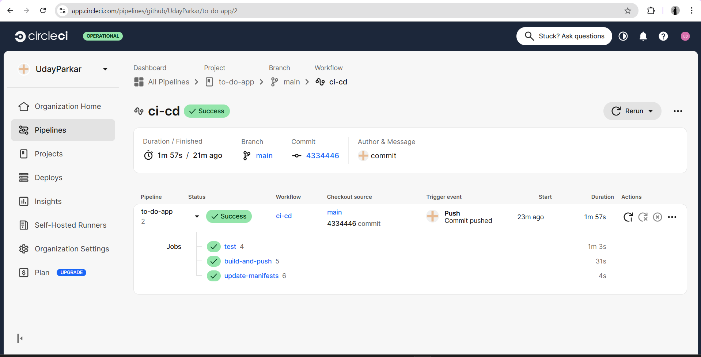
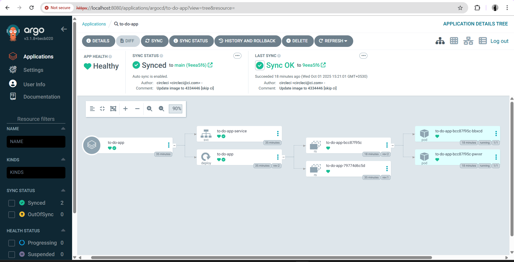
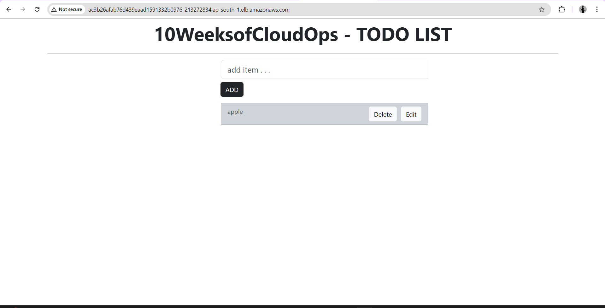

# 🚀 To-Do App Deployment on AWS EKS with GitOps (ArgoCD) & CI/CD (CircleCI)

## 📌 Project Overview

This project demonstrates a **cloud-native DevOps workflow** for deploying a React-based To-Do application using modern practices:

- **Terraform** → Infrastructure as Code (VPC, EKS, IAM, EC2 worker nodes)  
- **CircleCI** → CI/CD pipeline for Docker build & push  
- **ArgoCD** → GitOps for Kubernetes sync and self-healing  
- **Docker** → Containerized React app served via Nginx  

The result is a fully automated, scalable, and reliable workflow from **code → container → cluster → end-user**.

### Key Components:
- **AWS EKS Cluster**: Managed Kubernetes control plane
- **VPC & Subnets**: Secure network infrastructure with public/private subnets
- **CircleCI**: Automated CI/CD pipeline
- **ArgoCD**: GitOps continuous delivery tool
- **Docker Hub**: Container registry for storing Docker images
- **Application Load Balancer**: Exposes the application to end users

---

## 📂 Project Structure

```
to-do-app/
├── .circleci/
│   └── config.yml                    # CircleCI pipeline configuration
├── infra/
│   ├── terraform/
│   │   ├── bootstrap-backend/        # S3 backend for Terraform state
│   │   │   ├── main.tf               # Backend bucket configuration
│   │   │   ├── variables.tf          # Backend variables
│   │   │   └── outputs.tf            # Backend outputs
│   │   └── eks-cluster/
│   │       ├── main.tf               # Main Terraform configuration
│   │       ├── variables.tf          # Input variables
│   │       ├── outputs.tf            # Output values
│   │       ├── providers.tf          # Provider configuration
│   │       └── secrets.tf            # Sensitive data configuration
│   └── argocd/
│       ├── install.yaml              # ArgoCD installation manifest
│       └── argocd-app.yaml           # ArgoCD application definition
├── k8s/
│   ├── deployment.yaml               # Kubernetes deployment manifest
│   └── service.yaml                  # Kubernetes service manifest
├── images/                           # Screenshots and diagrams
│   ├── circleci_pipeline.png         # CircleCI pipeline output
│   ├── argocd_ui.png                 # ArgoCD dashboard screenshot
│   └── todo_app.png                  # Running application screenshot
├── src/                              # React application source code
├── public/                           # Static assets
├── Dockerfile                        # Container image definition
├── package.json                      # Node.js dependencies
├── .dockerignore                     # Docker build exclusions
├── .gitignore                        # Git exclusions
└── README.md                         # This file
```

---

## ⚙️ Workflow

### End-to-End Pipeline:

1. **Infrastructure Provisioning (Terraform)**  
   - Creates VPC with public/private subnets across multiple AZs
   - Provisions EKS cluster with managed node group
   - Configures IAM roles and security groups
   - Sets up networking components (NAT Gateway, Internet Gateway)

2. **Continuous Integration (CircleCI)**  
   - Triggers on Git push to main branch
   - Runs linting and unit tests
   - Builds Docker image with versioned tag
   - Pushes image to Docker Hub
   - Updates Kubernetes manifests with new image tag
   - Commits changes back to GitHub repository

3. **Continuous Deployment (ArgoCD)**  
   - Monitors GitHub repository for manifest changes
   - Automatically syncs desired state to EKS cluster
   - Performs health checks on deployed resources
   - Provides self-healing capabilities
   - Enables easy rollback if needed

4. **Kubernetes Orchestration**  
   - Deploys pods running the To-Do application
   - Creates LoadBalancer service
   - Manages replicas and rolling updates
   - Handles pod scheduling and resource allocation

5. **User Access**  
   - Application accessible via AWS ELB DNS hostname
   - Traffic routed through AWS Load Balancer
   - High availability across multiple nodes

---

## 🛠️ Prerequisites

Before you begin, ensure you have the following installed:

- **AWS CLI** (v2.x or higher) - [Installation Guide](https://docs.aws.amazon.com/cli/latest/userguide/install-cliv2.html)
- **Terraform** (v1.5+) - [Download](https://www.terraform.io/downloads.html)
- **kubectl** (v1.28+) - [Installation Guide](https://kubernetes.io/docs/tasks/tools/)
- **Docker** (v20.x+) - [Get Docker](https://docs.docker.com/get-docker/)
- **Git** - [Installation](https://git-scm.com/downloads)

### Required Accounts:
- AWS Account with appropriate IAM permissions
- Docker Hub account
- GitHub account
- CircleCI account

---

## 🚀 Getting Started

### Step 1: Clone the Repository

```bash
git clone https://github.com/your-username/to-do-app.git
cd to-do-app
```

### Step 2: Configure AWS Credentials

```bash
aws configure
# Enter your AWS Access Key ID, Secret Access Key, and default region
```

### Step 3: Initialize Terraform Backend

```bash
cd infra/terraform/bootstrap-backend
terraform init
terraform apply
```

### Step 4: Provision EKS Cluster

```bash
cd ../eks-cluster
terraform init
terraform apply
```

This will create:
- VPC with 3 public and 3 private subnets
- EKS cluster (control plane)
- Managed node group with 2-3 EC2 instances
- Required security groups and IAM roles

### Step 5: Configure kubectl

```bash
aws eks update-kubeconfig --region <your-region> --name <cluster-name>
kubectl get nodes
```

### Step 6: Install ArgoCD

```bash
kubectl create namespace argocd
kubectl apply -n argocd -f infra/argocd/install.yaml

# Wait for ArgoCD pods to be ready
kubectl wait --for=condition=ready pod -l app.kubernetes.io/name=argocd-server -n argocd --timeout=300s
```

### Step 7: Access ArgoCD UI

```bash
# Get the initial admin password
kubectl -n argocd get secret argocd-initial-admin-secret -o jsonpath="{.data.password}" | base64 -d

# Port-forward to access UI
kubectl port-forward svc/argocd-server -n argocd 8080:443
```

Open browser: `https://localhost:8080`  
Username: `admin`  
Password: (from the command above)

### Step 8: Deploy Application via ArgoCD

```bash
kubectl apply -f infra/argocd/argocd-app.yaml
```

### Step 9: Configure CircleCI

1. Go to [CircleCI Dashboard](https://app.circleci.com/)
2. Connect your GitHub repository
3. Add environment variables:
   - `DOCKER_USERNAME`
   - `DOCKER_PASSWORD`
   - `GITHUB_TOKEN`
4. Trigger pipeline by pushing to main branch

### Step 10: Access the Application

```bash
kubectl get svc -n default
# Find the EXTERNAL-IP (AWS ELB DNS name)
```

Open browser: `http://<EXTERNAL-IP>`

---

## 📸 Verification & Screenshots

### 1. CircleCI Pipeline  


**Expected Output:**
- ✅ Build job: Success
- ✅ Test job: All tests passed
- ✅ Docker build & push: Image uploaded
- ✅ Update manifests: Committed to GitHub

### 2. ArgoCD UI (Application Synced & Healthy)  


**Status Indicators:**
- **Sync Status**: Synced
- **Health Status**: Healthy

### 3. To-Do App Running on AWS ELB  


**Features:**
- Add, edit, delete tasks
- Mark tasks as complete
- Persistent storage
- Responsive UI

### 4. Terminal Verification  

**Check Nodes:**
```bash
kubectl get nodes

# Expected output:
NAME                           STATUS   ROLES    AGE   VERSION
ip-10-0-1-123.ec2.internal    Ready    <none>   1h    v1.28.x
ip-10-0-2-124.ec2.internal    Ready    <none>   1h    v1.28.x
```

**Check Pods:**
```bash
kubectl get pods -n default

# Expected output:
NAME                          READY   STATUS    RESTARTS   AGE
todo-app-5f6d8c9b7d-abc12    1/1     Running   0          10m
todo-app-5f6d8c9b7d-def34    1/1     Running   0          10m
```

**Check Service:**
```bash
kubectl get svc -n default

# Expected output:
NAME         TYPE           CLUSTER-IP       EXTERNAL-IP                                                               PORT(S)        AGE
todo-app     LoadBalancer   172.20.123.45    a1b2c3d4e5f6g7h8-1234567890.us-east-1.elb.amazonaws.com                 80:30123/TCP   10m
```

**Check ArgoCD Application:**
```bash
kubectl get application -n argocd

# Expected output:
NAME       SYNC STATUS   HEALTH STATUS
todo-app   Synced        Healthy
```

---

## 🔧 Configuration

### Environment Variables (CircleCI)

| Variable | Description | Example |
|----------|-------------|---------|
| `DOCKER_USERNAME` | Docker Hub username | `myusername` |
| `DOCKER_PASSWORD` | Docker Hub password or token | `dckr_pat_xxxxx` |
| `GITHUB_TOKEN` | GitHub Personal Access Token | `ghp_xxxxx` |

### Terraform Variables

Edit `infra/terraform/eks-cluster/terraform.tfvars`:

```hcl
cluster_name    = "my-eks-cluster"
region          = "us-east-1"
node_count      = 2
instance_type   = "t3.medium"
```

### Kubernetes Resources

**Deployment** (`k8s/deployment.yaml`):
- Replicas: 2 (configurable)
- Image: Updated automatically by CircleCI
- Resource limits: 500m CPU, 512Mi memory

**Service** (`k8s/service.yaml`):
- Type: LoadBalancer
- Port: 80
- Target Port: 80

---

## 🔍 Monitoring & Troubleshooting

### Common Issues

**1. Pods not starting:**
```bash
kubectl describe pod <pod-name>
kubectl logs <pod-name>
```

**2. Service not getting external IP:**
```bash
kubectl describe svc todo-app
# Check AWS Load Balancer creation in AWS Console
```

**3. ArgoCD sync failing:**
```bash
kubectl logs -n argocd deployment/argocd-application-controller
```

**4. CircleCI build failing:**
- Check CircleCI dashboard for error logs
- Verify environment variables are set correctly
- Ensure Docker Hub credentials are valid

### Health Checks

```bash
# Check cluster health
kubectl cluster-info

# Check all resources
kubectl get all -n default

# Check ArgoCD status
kubectl get pods -n argocd
```

---

## 🧹 Cleanup

To avoid AWS charges, destroy all resources:

```bash
# Delete Kubernetes resources
kubectl delete -f k8s/

# Delete ArgoCD
kubectl delete -n argocd -f infra/argocd/install.yaml
kubectl delete namespace argocd

# Destroy EKS cluster
cd infra/terraform/eks-cluster
terraform destroy

# Destroy backend (optional)
cd ../bootstrap-backend
terraform destroy
```

⚠️ **Warning**: This will permanently delete all resources and data.

---

## 📚 Additional Resources

- [AWS EKS Documentation](https://docs.aws.amazon.com/eks/)
- [ArgoCD Documentation](https://argo-cd.readthedocs.io/)
- [CircleCI Documentation](https://circleci.com/docs/)
- [Kubernetes Documentation](https://kubernetes.io/docs/)
- [Terraform AWS Provider](https://registry.terraform.io/providers/hashicorp/aws/latest/docs)

---

## 👨‍💻 Author

**Your Name**  
- GitHub: [@your-username](https://github.com/your-username)
- LinkedIn: [Your Profile](https://linkedin.com/in/your-profile)
- Email: your.email@example.com